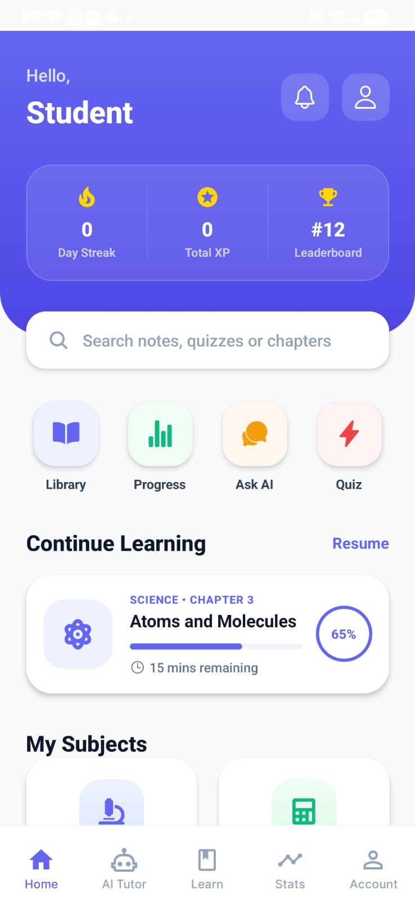
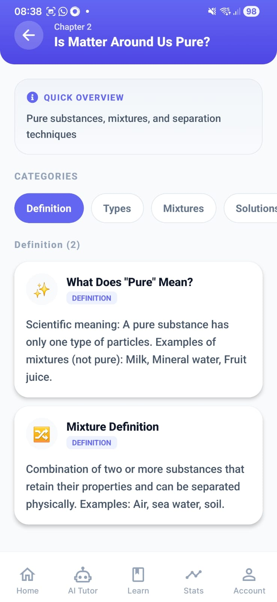
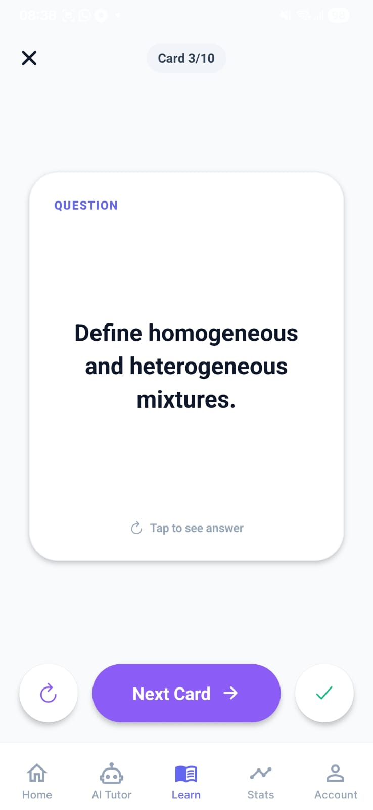
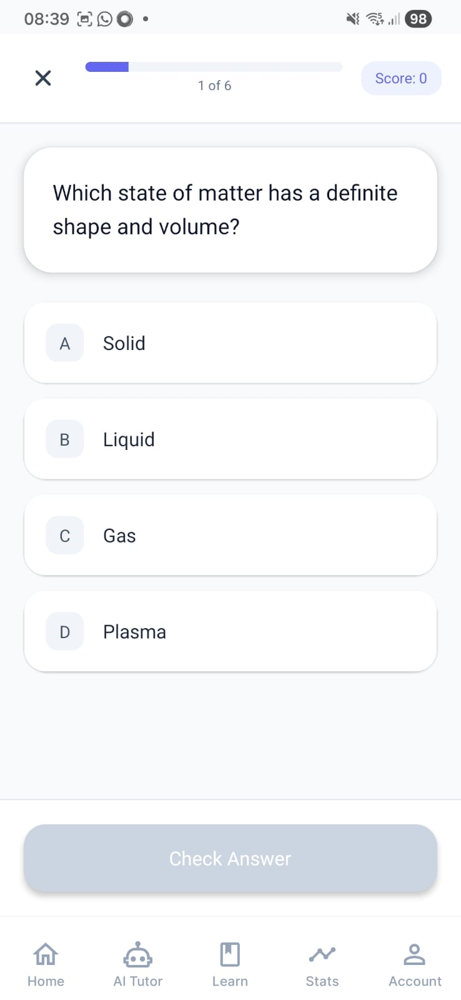
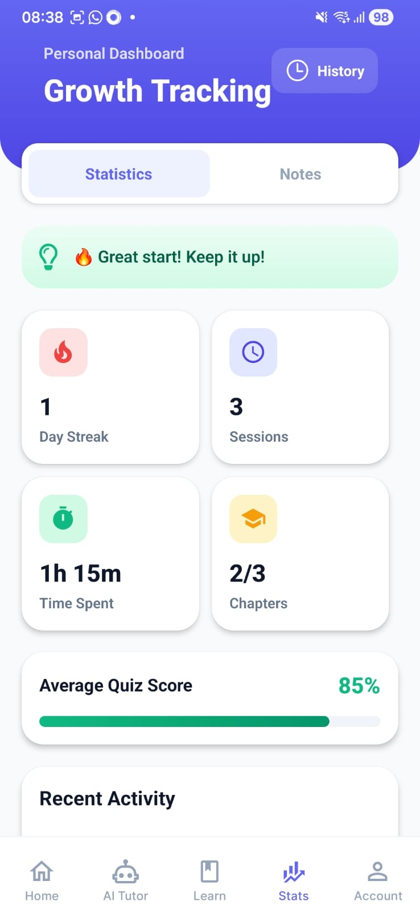
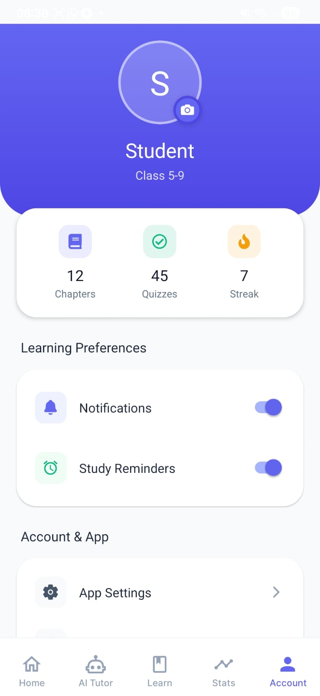

# 📚 Shiksha AI

**GitHub Repository:** [https://github.com/DevSidd2006/Shiksha-AI](https://github.com/DevSidd2006/Shiksha-AI)

## 🌟 Project Overview
Shiksha AI is an **offline-first AI-powered tutor** specifically designed for Class 9-10 students in India. It aims to bridge the digital divide by providing high-quality, personalized educational support even in areas with limited or no internet connectivity. By leveraging local LLMs and vision models, Shiksha AI allows students to ask questions, solve math problems, and understand complex concepts through text, voice, and image analysis.

### The Problem it Solves
- **Internet Dependency:** Most AI educational tools require a stable internet connection, which is often unavailable in rural or remote areas.
- **Language Barriers:** Provides support in regional languages (starting with Hindi) to make learning accessible.
- **Personalized Learning:** Offers a 1:1 tutoring experience that adapts to the student's progress and curriculum (CBSE/State Boards).

## 🚀 Project Details
### The Idea
The core idea is to democratize education by localizing AI. By running lightweight, optimized models directly on the user's device or a local server (via Ollama), we ensure that learning never stops due to data limits or poor reception.

### Technology Stack & Tools
- **Frontend:** React Native with Expo (SDK 54) for a seamless cross-platform mobile experience.
- **AI Models:** 
  - **Llama 3.2 (3b):** Primary reasoning and tutoring engine.
  - **Qwen3-VL (2b):** Vision-language model for analyzing textbook images and diagrams.
  - **Ollama:** Used for local health and orchestration of AI models.
- **Storage:** 
  - **Expo SQLite:** For structured data like progress, quizzes, and local chat history.
  - **Zustand:** For local state management ($authStore.ts$, $chatStore.ts$).
- **Data & Tools:**
  - **Tesseract.js:** For OCR (Optical Character Recognition) of textbook text.
  - **Expo Speech:** For Text-to-Speech capabilities in multiple languages.
  - **Math.js / KaTeX:** For rendering and solving mathematical equations.
- **Backend (Optional Sync):** Node.js/Express for cloud backup and analytics when online.

---

## ⚡ Quick Start

```bash
# 1. Clone & install
git clone https://github.com/yourusername/shiksha-ai.git
cd shiksha-ai && npm install

# 2. Pull AI models
ollama pull llama3.2:3b      # Primary tutor
ollama pull qwen3-vl:2b      # Vision model
ollama pull gemma3:1b        # Fallback
ollama serve

# 3. Start backend
cd backend && npm install && npm start  # → localhost:3000

# 4. Run app
cd .. && npm start  # Press 'a' for Android, 'w' for web
```

### Environment
Create `.env` in project root:
```
EXPO_PUBLIC_API_URL=http://10.0.2.2:3000
```

---

## Features

| Feature | Description |
|---------|-------------|
| 🤖 AI Tutor | Chat with vision-capable AI |
| 📸 Image Analysis | Snap textbook problems for explanations |
| � Text-to-Speech | Hear responses in Hindi, English & more |
| �📝 Notes | Create study notes |
| 🎴 Flashcards | Interactive revision cards |
| ❓ Quizzes | Test your knowledge |
| 📊 Progress | Track learning journey |

---

## 📱 Screenshots

<div align="center">
  <table style="width: 100%; border-collapse: collapse;">
    <tr>
      <td align="center"><b>Dashboard</b><br/></td>
      <td align="center"><b>AI Tutor Chat</b><br/></td>
      <td align="center"><b>Study Notes</b><br/></td>
    </tr>
    <tr>
      <td align="center"><b>Flashcards</b><br/></td>
      <td align="center"><b>Interactive Quizzes</b><br/></td>
      <td align="center"><b>Progress Tracker</b><br/></td>
    </tr>
    <tr>
      <td align="center" colspan="3"><b>User Profile</b><br/></td>
    </tr>
  </table>
</div>

---

```
app/(tabs)/          # Screens: tutor, notes, flashcards, quiz, progress, settings
src/
├── components/      # AuthScreen, ChatBubble, SpotlightTutorial
├── services/        # api, visionService, ocrService, offlineTutor
├── storage/         # Zustand stores (auth, chat, profile, settings)
└── data/            # Class 9 Science content
backend/
├── server.js        # Express API (OCR, tutor proxy, translation)
└── translator_service.py  # NLLB-200 translation (optional)
```

---

## Required Models

| Model | Purpose | Command |
|-------|---------|---------|
| llama3.2:3b | Primary tutor | `ollama pull llama3.2:3b` |
| qwen3-vl:2b | Image analysis | `ollama pull qwen3-vl:2b` |
| gemma3:1b | OCR fallback | `ollama pull gemma3:1b` |

---

## Text-to-Speech (Multilingual)

Built-in speech synthesis for AI responses. **No additional setup required.**

```bash
# Test TTS configuration
node test-tts.js english "Hello, this is a test"
node test-tts.js hindi "नमस्ते, यह एक परीक्षण है"
```

**How to use in app:**
1. Tap speaker icon 🔊 on any tutor response
2. Audio plays in your preferred language
3. Change language in Settings → adjust playback language
4. Rate: 0.9 (slightly slower for clarity)

**Supported Languages:**
- English (en-IN) / US English (en-US)
- Hindi (hi-IN)
- Marathi, Tamil, Telugu, Kannada, Malayalam, Gujarati, Punjabi, Bengali

---

## Multilingual (Optional)

```bash
# Install Python deps
pip install fastapi uvicorn transformers torch sentencepiece

# Start translation service
cd backend && python translator_service.py  # → localhost:3001
```

Supports: English, Hindi, Marathi, Tamil, Telugu, Bengali

---

## Troubleshooting

| Issue | Fix |
|-------|-----|
| Ollama not connecting | `ollama serve` + check firewall |
| Vision model error | `ollama pull qwen3-vl:2b` |
| OCR not working | Start backend on port 3000 |
| Translation failing | Start `translator_service.py` on 3001 |

---

MIT License
